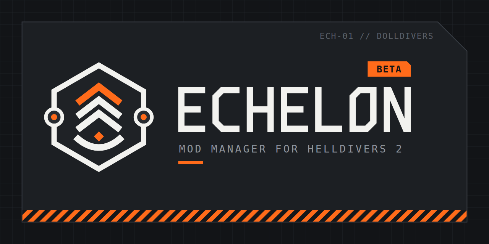

# Echelon

A mod manager for Helldivers 2. Keep a library of mods, arrange them into profiles, and deploy a whole profile to the game in one click.

**Status: beta.** Back up anything you care about, and please report problems (see below).

## Download

Get **Echelon-Setup-x.y.z.exe** from the [latest release](../../releases/latest) and run it. It installs for your user only, with no admin prompt.

Windows may say "Windows protected your PC" because Echelon is new and not code-signed yet. Click **More info → Run anyway**.

## What it does

- **Library and profiles:** add mods from .zip, .rar, .7z or folders; build profiles with load order, separators, tags and per-mod options.
- **One-click deploy:** puts exactly the active profile into the game (and can purge the game back to unmodded).
- **Bingus Shared Loader support:** recognises the loader and the mods that need it, warns when a profile is missing it, and keeps it in the right load-order spot automatically so Bingus mods actually start.
- **Import from HD2 Arsenal:** bring your mods, profiles and option choices over.
- **Share profiles:** as short codes (`EC-XXXX-XXXX`) or links.
- **Developer Suite:** Mod Builder and Repatcher for modders.
- **Languages:** English, Simplified Chinese, Japanese.

## Privacy

Echelon works offline. Its online features are off until you turn them on in the first-time setup or Settings: update checks (GitHub), mod-text translation (MyMemory), and profile sharing (only when you share or open a profile). It has no tracking or advertising.

## Support

Echelon is free, and every feature is available to everyone. If you'd like to support its development, you can leave a tip on [Ko-fi](https://ko-fi.com/avaleine). Donations are entirely optional and don't unlock anything.

## Reporting a problem

Open an [issue](../../issues) and attach your latest log from `%APPDATA%\Echelon\logs` (Settings > System > About shows the exact path).

## Legal

Echelon is an unofficial fan-made tool, not affiliated with or endorsed by Arrowhead Game Studios or Sony Interactive Entertainment. Using it means accepting the [end-user licence agreement](EULA.txt). Third-party components and their licences are listed in [THIRD_PARTY_NOTICES.txt](THIRD_PARTY_NOTICES.txt).
